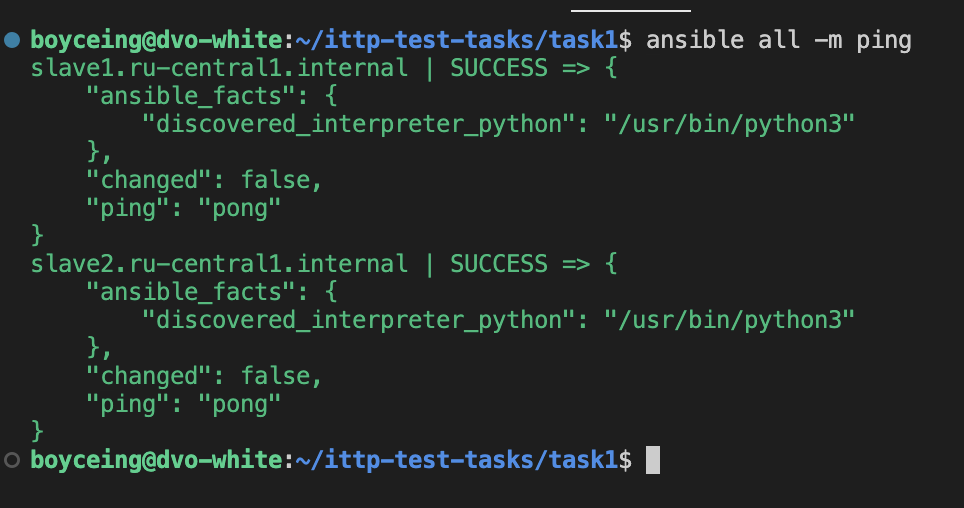
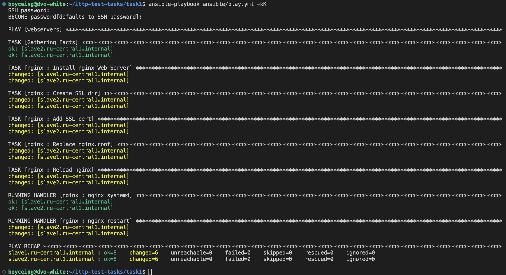
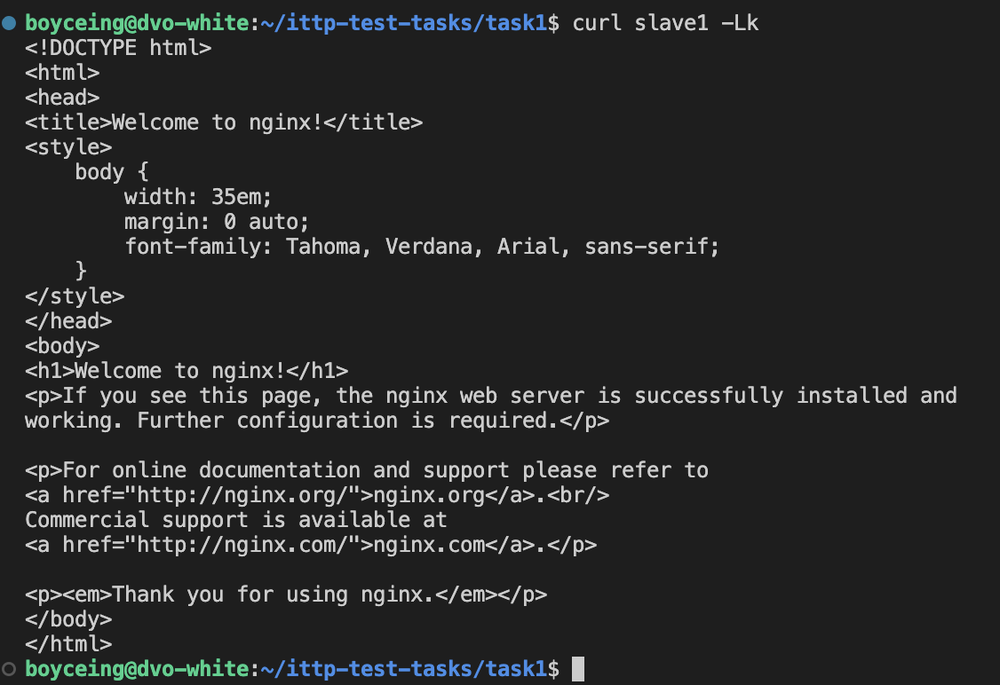

Ansible в прошлом "трогал" лишь немного, поэтому для выполнения задания пользовался гайдом вот тут: https://www.dmosk.ru/instruktions.php?object=ansible-nginx-install

Дальше буду изучать инструмент глубже

# пингуем хосты

# запускает playbook

# проверяем, что страница доступна (флаг L нужен, чтобы пойти по редиректу; k - чтобы пройти по небезопасному сертификату)

