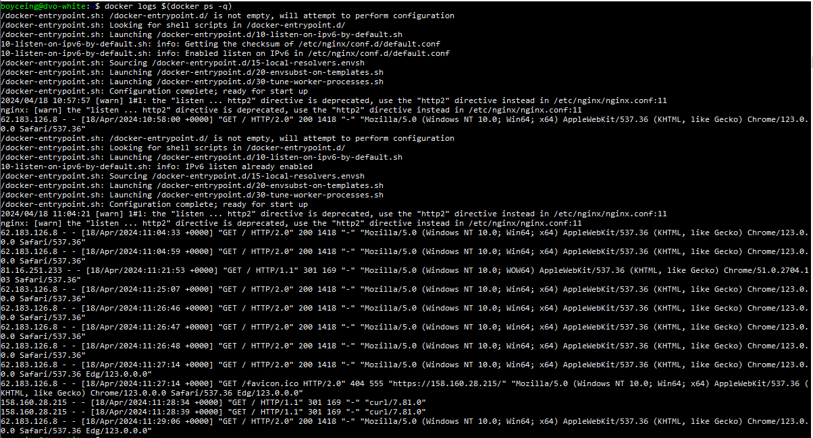
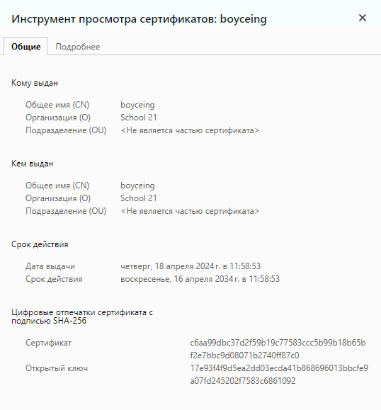

# генерация сертификата и ключа 

`$ openssl req -x509 -nodes -days 3650 -newkey rsa:2048 -keyout nginx/ssl/nginx.key -out nginx/ssl/nginx.crt`

# Докер образ

Образ простой, просто копируем сертификат, ключ и конфиг в образ \
Если есть нужда запустить контейнер без композа, то можно убрать комментарий в докерфайле и запустить контейнер обычным раном

`docker run -d -p 80:80 -p 443:443 image_name`

# Docker compose 

Тут все тоже предельно просто - добавляем volume и прописываем `restart: always`, таким образом сервис будет запускаться при каждой загрузке системы (docker демона),
если заранее был вызван `docker-compose up -d`

> Логи контейнера

> Данные о сертификате в хроме

[логи curl и страница](./curl_logs.txt)

### пользуюсь виртаульной машиной с белым адресом в yandex cloud, поэтому обращаюсь в такому ip