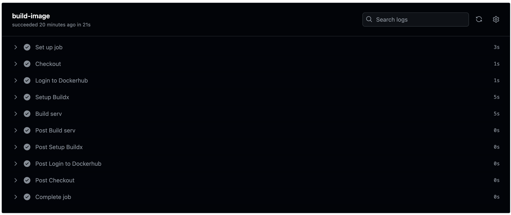
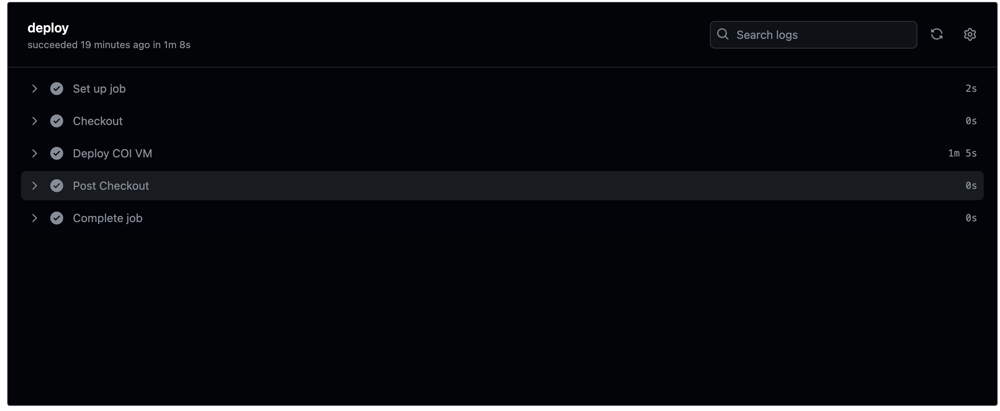

Первый более-менее серьезный опыт работы с github actions, до этого часто работал с gitlab CI \
Опыт был интересный, я бы даже сказал, что очень интересный \
Достаточно удобные иструменты для работы с docker и yandex cloud \
Работа с секретами тоже показалась очень удобной \
Самый большой плюс - не нужно было поднимать свой раннер, как в том же gitlab CI. Изначальной квоты более чем хватает для заданных целей 

[файл](../.github/workflows/docker-cicd.yml) со сценарием находится в папке `.github/workflows/docker-cicd.yml`

CI происходит посредством `docker/login-action@v3`, `docker/setup-buildx-action@v2`, `docker/build-push-action@v3` \
Собирается образ и пушится в DockerHub, образу дается заданное имя и тэг в виде хэша, вычисленного платформой

CD организован при помощи `yc-actions/yc-coi-deploy@v2` - безумно удобный инструмент, который позволяет внутри пайплайна создавать или обновлять уже существующую VM типа Container Optimized Image и незамедлительно получить доступ к рабочему стенду с развернутым приложением

